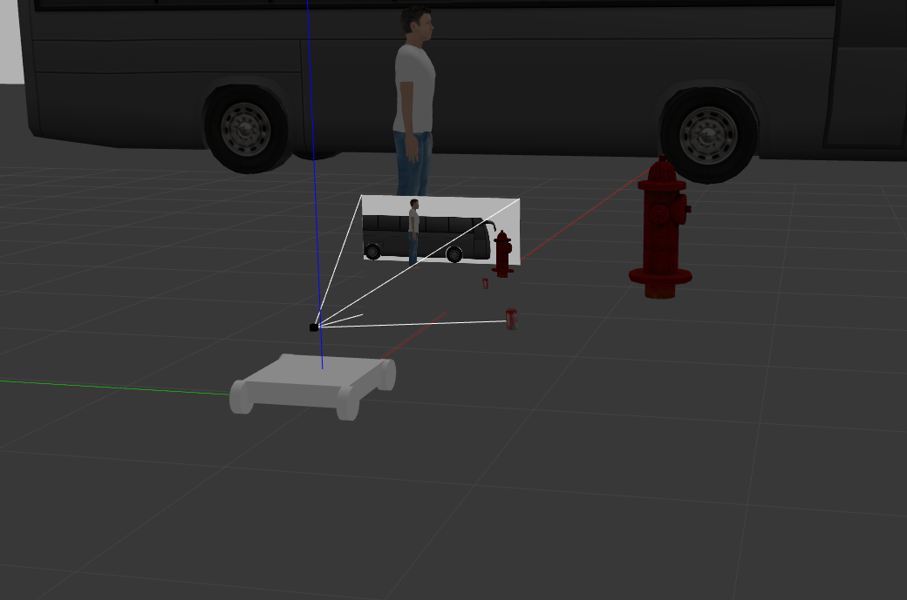
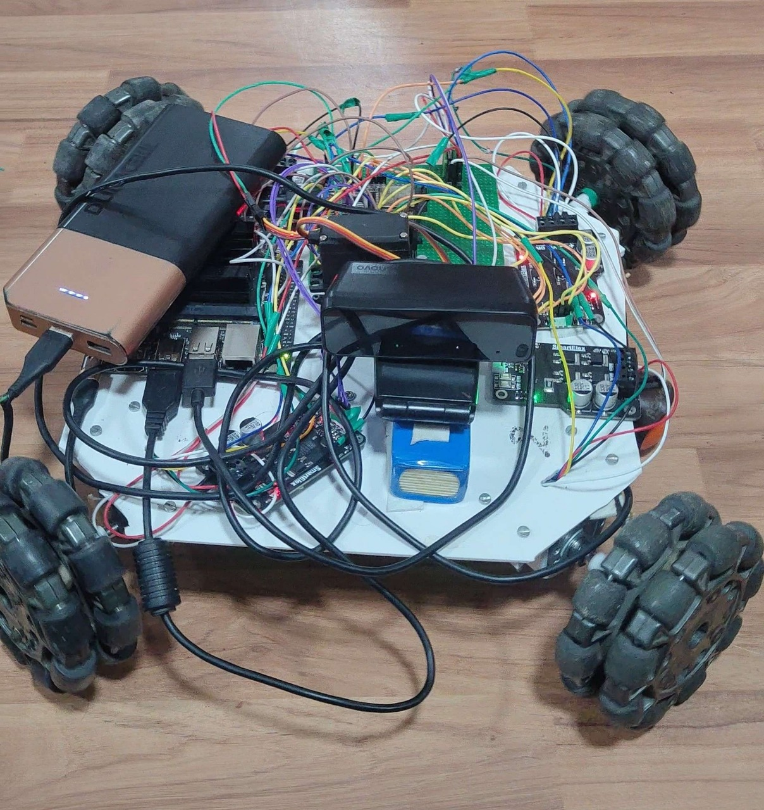

# Ballerina-Cappucina

# SRA Eklavya 2025 Project - Ballerina-Cappucina

## Mentors:
- Prajwal Avhad
- Soham Kute
- Harsh

## Mentees:
- Lakshya Lalwani
- Vedant Malkar
- Bhakti Assar

## Project Description:

Ballerina Cappucina, a graceful omnidirectional robot with a critical mission. This project brings her to life by designing and building a robot that can autonomously glide across a “dance floor,” identify scattered colorful “bombs” (balls), and scoop them up with precision.

A custom omnidirectional mobile base is created that allows for fluid movement, and a vision system using OpenCV for color detection. Integrating these systems we enable Ballerina Cappucina to autonomously seek, collect, and sort the objects, clearing the stage.


---
### Setup Instructions:
1. Clone this repository into your ROS 2 workspace folder:
```
git clone 
```
2. Build the workspace
```
cd Ballerina-Cappucina/
cd ros_ws/
colcon build
```
3. Source the workspace
```
source install/setup.bash
```
4. Launch the robot simulation
```
ros2 launch gz_rosa_control omni_bot.launch.py
```
5. To control your bot using keyboard, in a new terminal
```
source ~/ros_ws/install/setup.bash
ros2 run teleop_twist_keyboard teleop_twist_keyboard --ros-args -r cmd_vel:=/omni_bot/cmd_vel
```
6. Image processing node (select colour - blue,yellow,green)
```
ros2 launch ball_tracker detect_ball_launch.py color:=yellow
```
7. Start bot movement
```
ros2 run ball_tracker move_bot
```



## Hardware:

To implement this project in real life, you’ll need the following hardware components:

- Jetson Nano (Main computing unit)

- 4 Omni-Wheels (For omnidirectional movement)

- 4 Rhino GB37 Servo Motors (For movement control)

- 4 Cytron DC Motor Drivers (For motor control)

- Webcam (For visual perception)

- ESP32 (For communication and control)

- MG995 Servo Motor (For ball trapping mechanism)


